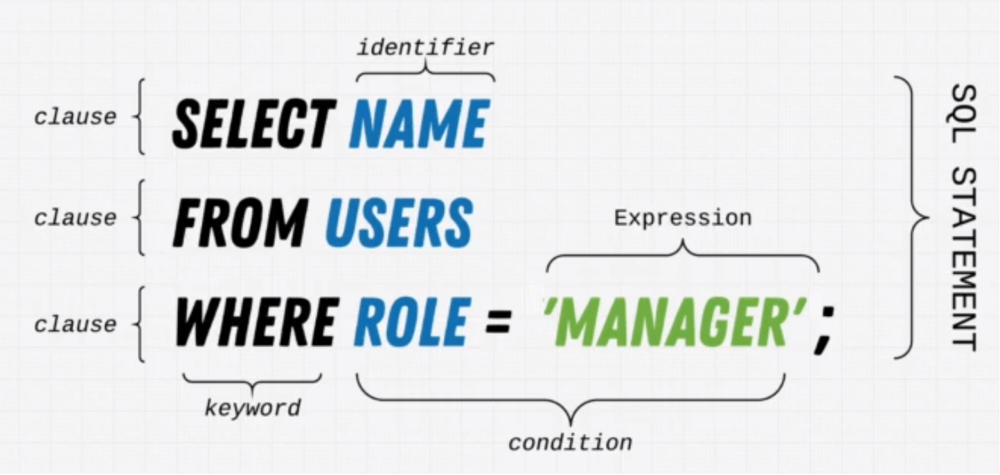

# Complete SQL and Database Bootcamp

## Sections

- [Introduction](#introduction)
- [History and story of Data](#history-and-story-of-data)
- [Databases and SQL fundamentals](#databases-and-sql-fundamentals)
- [Environment setup](#environment-setup)
- [SQL Deep dive](#SQL-deep-dive)
- [Advanced SQL](#advanced-sql)
- [Database management](#Database-management)
- [Solving the mistery](#Solving-the-mistery)
- [Database design](#database-design)
- [Database engineering](#database-engineering)
- [Redis](#redis)

## Intruduction

## History and story of data
- database: a collection of data with method for accessing and manipulating it.
- DBMS: Database management system. Relational DBMS
- Data - DBMS/RDBMS (postgreSQL) - SQL
- Compatible
- types of DB
    - Relational: SQL, postgreSQL, SQL server
    - Document: MongoDB, FireDB -> scalability
    - Key value: redix..simplest way
    - Graph: social network
    - Wide columnar: google's big table

## Databases and SQL fundamentals
- database: a structured set of data.
- SQL: a language used to talk to our databases to get a specific output.
- Query/SQL STATEMENT: put together our questions to which want an answer from a database. SELECT*FROM USERS

